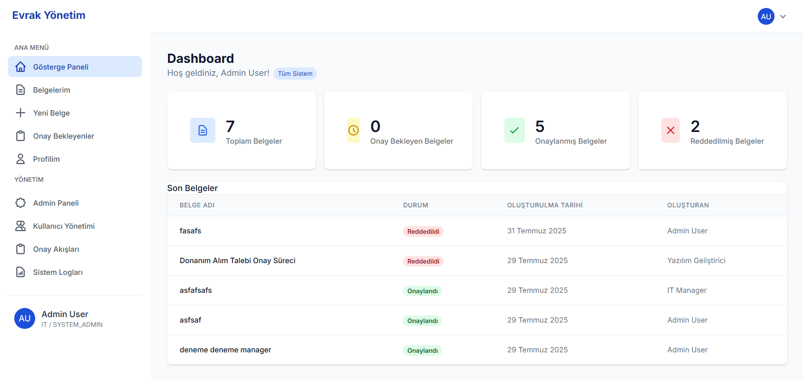
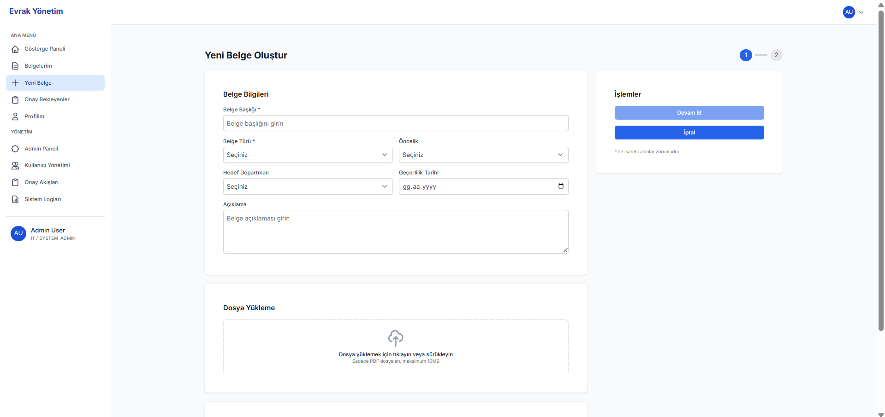
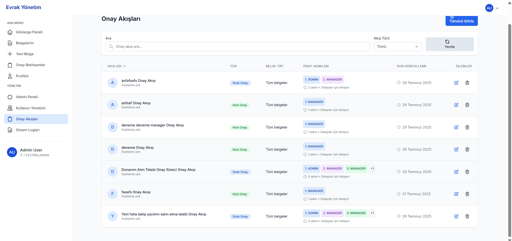

# Document Management System

## Proje Açıklaması

Bu proje, kuruluşların belge yönetimi ve onay süreçlerini dijitalleştirmek için tasarlanmış kapsamlı bir Belge Yönetim Sistemidir. Sistem, belge oluşturma, takip etme, onaylama ve arşivleme süreçlerini otomatikleştirerek iş akışlarını optimize eder.

### Temel Özellikler

- **Belge Yönetimi**: Belgelerin oluşturulması, düzenlenmesi, görüntülenmesi ve silinmesi
- **Onay Akışları**: Sıralı ve hızlı onay süreçleri için yapılandırılabilir akışlar
- **Rol Tabanlı Erişim Kontrolü**: ADMIN, MANAGER, OFFICER ve OBSERVER rolleri
- **PDF Oluşturma**: Dinamik form verilerinden PDF belgeleri oluşturma
- **Aktivite İzleme**: Tüm kullanıcı eylemlerinin detaylı kaydı

## Teknoloji Yığını

### Backend
- **Node.js** ve **Express.js** - Sunucu tarafı uygulama
- **MongoDB** ve **Mongoose** - Veritabanı ve ODM
- **JWT** - Kimlik doğrulama ve yetkilendirme
- **Multer** - Dosya yükleme işlemleri
- **Winston** - Loglama

### Frontend
- **React.js** - Kullanıcı arayüzü
- **React Router** - Sayfa yönlendirme
- **Context API** - Durum yönetimi
- **Axios** - API iletişimi
- **Tailwind CSS** - Stil ve tasarım
- **React Hook Form** - Form yönetimi

## Mimari

Proje, modüler ve katmanlı bir mimari kullanır:

### Backend Mimarisi
1. **Routes Katmanı**: API endpoint tanımları
2. **Controller Katmanı**: HTTP istekleri/yanıtları yönetimi
3. **Service Katmanı**: İş mantığı uygulaması
4. **Model Katmanı**: Veritabanı şemaları ve veri doğrulama
5. **Utility Katmanı**: Yardımcı fonksiyonlar
6. **Middleware Katmanı**: Kimlik doğrulama, hata yönetimi, loglama

### Frontend Mimarisi
1. **Routing Katmanı**: Sayfa yönlendirme ve rota koruması
2. **Layout Katmanı**: Tutarlı sayfa yapısı
3. **Component Katmanı**: Yeniden kullanılabilir UI bileşenleri
4. **Context Katmanı**: Global durum yönetimi
5. **Hook Katmanı**: Özel React hook'ları
6. **API Katmanı**: Axios tabanlı API istemcileri
7. **Utility Katmanı**: Yardımcı fonksiyonlar

## Kurulum

### Gereksinimler
- Node.js (v14 veya üzeri)
- MongoDB (v4 veya üzeri)
- npm veya yarn

### Backend Kurulumu
```bash
# Backend dizinine geçin
cd backend

# Bağımlılıkları yükleyin
npm install

# .env.example dosyasını .env olarak kopyalayın
cp .env.example .env

# .env dosyasını düzenleyin ve gerekli bilgileri girin
# Özellikle MongoDB URI ve JWT secret değerlerini ayarlayın

# Uygulamayı başlatın
npm start
```

### Frontend Kurulumu
```bash
# Frontend dizinine geçin
cd frontend

# Bağımlılıkları yükleyin
npm install

# Uygulamayı geliştirme modunda başlatın
npm start
```

## Dokümantasyon

Daha detaylı teknik dokümantasyon için:

- [Backend Dokümantasyonu](backend/BACKEND-DOCUMENTATION.md)
- [Frontend Dokümantasyonu](frontend/FRONTEND-DOCUMENTATION.md)

## Ekran Görüntüleri

### Gösterge Paneli


### Belge Yönetimi


### Onay Akışı


## Lisans

Bu proje MIT lisansı altında lisanslanmıştır. Detaylar için [LICENSE](LICENSE) dosyasına bakın.

## İletişim

Samet Şanlıkan - [GitHub](https://github.com/EngineerSamet)


